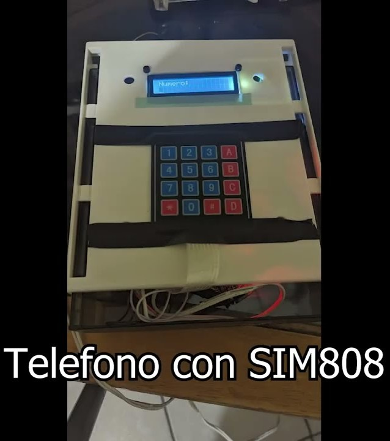

# Phone with stm32

# Materials
* STM32F103C8T6
* SIM808
* LCD 16X2
* 4x4 matrix keyboard
* Buzzer
* 330 ohm resistor
* Transistor 2N2222a
* Voltage regulator l7805cv
* Charger with 12 volt jack input with 2 Amps

# Youtube video
[Tutorial video](https://www.youtube.com/watch?v=UcNgU44lmwU)
